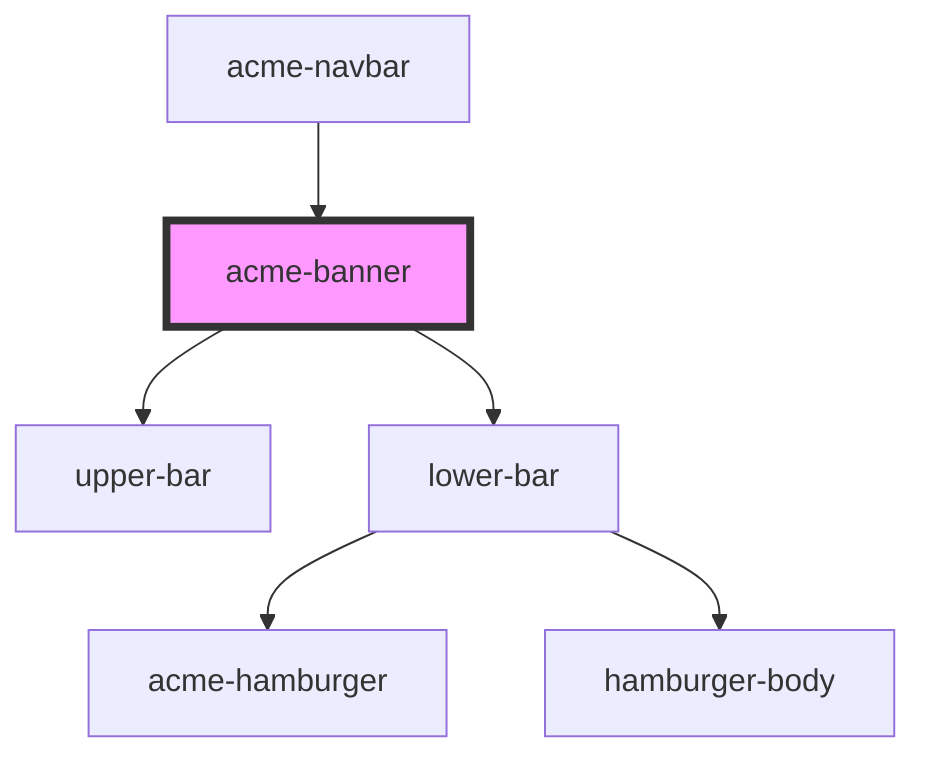

# acme-banner

<!-- Auto Generated Below -->

## Properties

| Property   | Attribute  | Description | Type     | Default     |
| ---------- | ---------- | ----------- | -------- | ----------- |
| `contacts` | `contacts` |             | `string` | `undefined` |
| `phone`    | `phone`    |             | `string` | `undefined` |
| `products` | `products` |             | `string` | `undefined` |
| `services` | `services` |             | `string` | `undefined` |
| `tagline`  | `tagline`  |             | `string` | `undefined` |
| `who`      | `who`      |             | `string` | `undefined` |

## Dependencies

### Used by

 - [acme-navbar](../acme-navbar)

### Depends on

- [upper-bar](../upper-bar)
- [lower-bar](../lower-bar)

### Graph

----------------------------------------------

*Built with [StencilJS](https://stenciljs.com/)*
