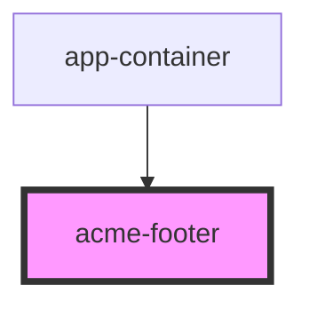

# acme-footer

<!-- Auto Generated Below -->

## Properties

| Property        | Attribute         | Description                          | Type     | Default     |
| --------------- | ----------------- | ------------------------------------ | -------- | ----------- |
| `headFiveOne`   | `head-five-one`   | value of first h5 in the footer      | `string` | `undefined` |
| `headFiveThree` | `head-five-three` | value of the last h5 in the footer   | `string` | `undefined` |
| `headFiveTwo`   | `head-five-two`   | value of the second h5 in the footer | `string` | `undefined` |

## Dependencies

### Used by

 - [app-container](../app-container)

### Graph

----------------------------------------------

*Built with [StencilJS](https://stenciljs.com/)*
