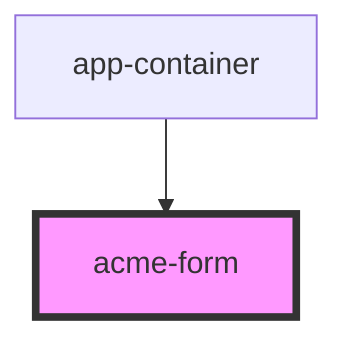

# acme-form
Form with css auto-validation.
This componend is divided in 2 parts:
-left: background image
-right: form input and send button

<!-- Auto Generated Below -->

## Dependencies

### Used by

 - [app-container](../app-container)

### Graph

----------------------------------------------

*Built with [StencilJS](https://stenciljs.com/)*
