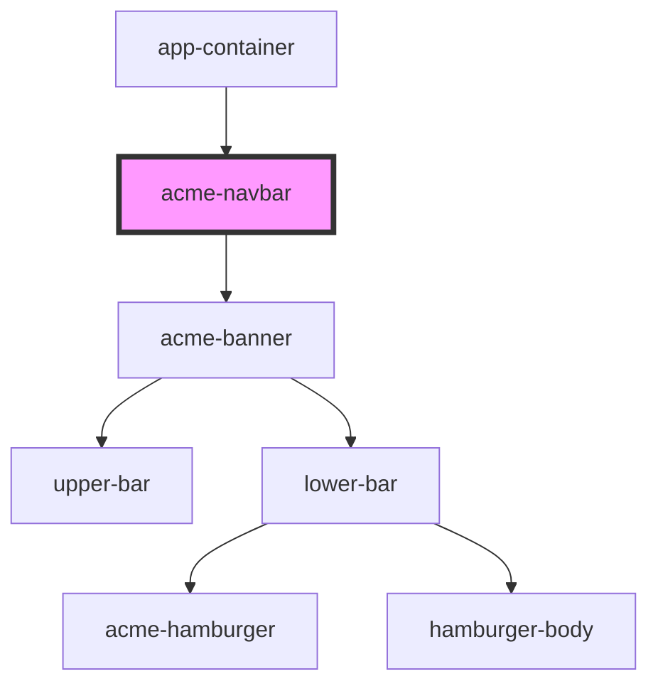

# acme-navbar
This component contains upper-bar where you can find search, telephone and login and the lower-bar where you can find about us, products
services,contacts in the hamburger menu.

<!-- Auto Generated Below -->

## Properties

| Property   | Attribute  | Description | Type     | Default     |
| ---------- | ---------- | ----------- | -------- | ----------- |
| `contacts` | `contacts` | Link for contacts form, email and telephone | `string` | `undefined` |
| `phone`    | `phone`    | Instant call for customer care              | `string` | `undefined` |
| `products` | `products` | Link for ACME financial products            | `string` | `undefined` |
| `services` | `services` | Link for private and companies services     | `string` | `undefined` |
| `tagline`  | `tagline`  | Welcome in ACME                             | `string` | `undefined` |
| `who`      | `who`      | Link to about us                            | `string` | `undefined` |

## Dependencies

### Used by

 - [app-container](../app-container)

### Depends on

- [acme-banner](../acme-banner)

### Graph

----------------------------------------------

*Built with [StencilJS](https://stenciljs.com/)*
