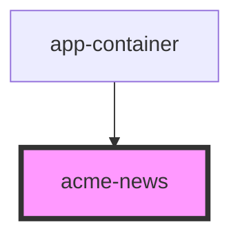

# acme-news
component that performs fetch request
and uploads the answers in the respective boxes

<!-- Auto Generated Below -->

## Dependencies

### Used by

 - [app-container](../app-container)

### Graph

----------------------------------------------

*Built with [StencilJS](https://stenciljs.com/)*
