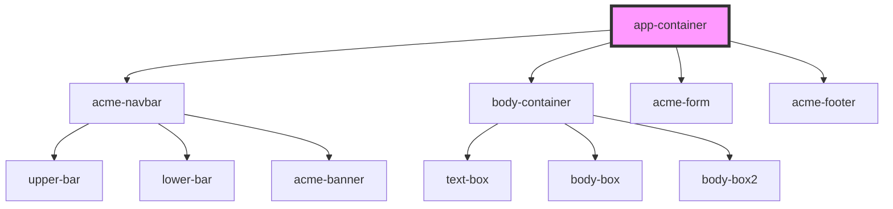

# app-container

<!-- Auto Generated Below -->

## Dependencies

### Depends on

- [acme-navbar](../acme-navbar)
- [body-container](../body-container)
- [acme-form](../acme-form)
- [acme-footer](../acme-footer)

### Graph

----------------------------------------------

*Built with [StencilJS](https://stenciljs.com/)*
