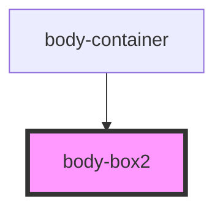

# body-box2

<!-- Auto Generated Below -->

## Dependencies

### Used by

 - [body-container](../body-container)

### Graph

----------------------------------------------

*Built with [StencilJS](https://stenciljs.com/)*
