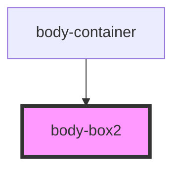

# body-box2
This is the second body-box with 2 areas:
-1) ACME for people Banner (It has a CTA for people services page)
-2) Cards (represent 3 main services for the privates)

<!-- Auto Generated Below -->

## Dependencies

### Used by

 - [body-container](../body-container)

### Graph

----------------------------------------------

*Built with [StencilJS](https://stenciljs.com/)*
