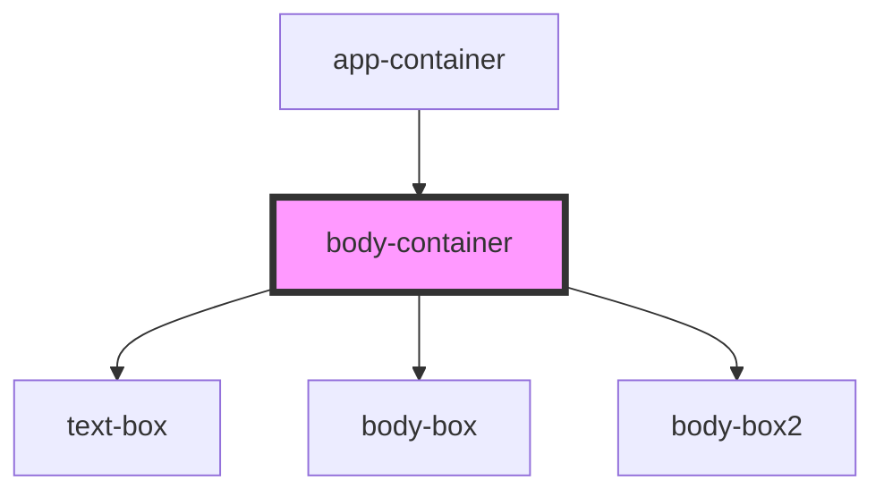

# body-container

<!-- Auto Generated Below -->

## Dependencies

### Used by

 - [app-container](../app-container)

### Depends on

- [text-box](../text-box)
- [body-box](../body-box)
- [body-box2](../body-box2)

### Graph

----------------------------------------------

*Built with [StencilJS](https://stenciljs.com/)*
