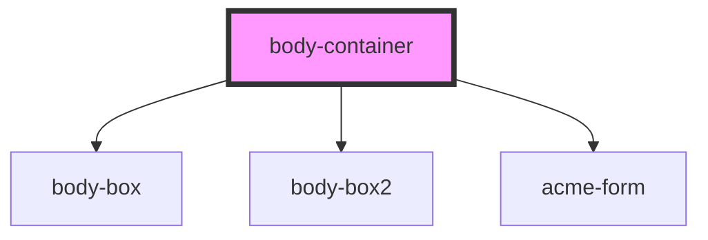

# body-container

<!-- Auto Generated Below -->

## Dependencies

### Depends on

- [body-box](../body-box)
- [body-box2](../body-box2)
- [acme-form](../acme-form)

### Graph

----------------------------------------------

*Built with [StencilJS](https://stenciljs.com/)*
