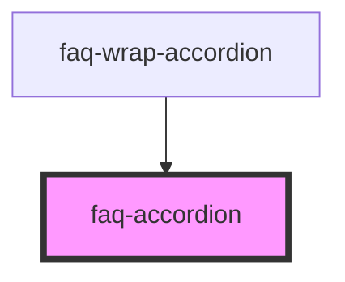

# faq-accordion

<!-- Auto Generated Below -->

## Properties

| Property   | Attribute  | Description                                              | Type     | Default     |
| ---------- | ---------- | -------------------------------------------------------- | -------- | ----------- |
| `answer`   | `answer`   | pass the content of faq answer from faq-wrap-acoordion   | `string` | `undefined` |
| `question` | `question` | pass the content of faq question from faq-wrap-acoordion | `string` | `undefined` |
| `width`    | `width`    | pass the width of faq-accordion                          | `string` | `undefined` |

## Events

| Event      | Description               | Type               |
| ---------- | ------------------------- | ------------------ |
| `myToggle` | event of toggle accordion | `CustomEvent<any>` |

## Dependencies

### Used by

 - [faq-wrap-accordion](../faq-wrap-accordion)

### Graph

----------------------------------------------

*Built with [StencilJS](https://stenciljs.com/)*
