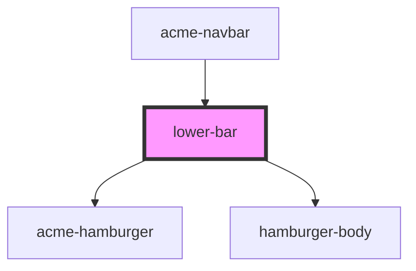

# lower-bar

<!-- Auto Generated Below -->

## Properties

| Property   | Attribute  | Description | Type     | Default     |
| ---------- | ---------- | ----------- | -------- | ----------- |
| `contacts` | `contacts` |             | `string` | `undefined` |
| `products` | `products` |             | `string` | `undefined` |
| `services` | `services` |             | `string` | `undefined` |
| `who`      | `who`      |             | `string` | `undefined` |

## Dependencies

### Used by

 - [acme-navbar](../acme-navbar)

### Depends on

- [acme-hamburger](../acme-hamburger)
- [hamburger-body](../hamburger-body)

### Graph

----------------------------------------------

*Built with [StencilJS](https://stenciljs.com/)*
